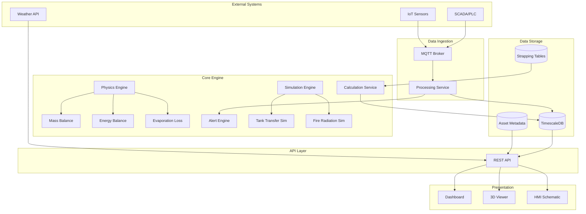
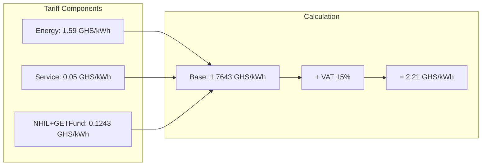

# Fuel Depot Digital Twin

[](https://python.org)
[](https://www.timescale.com/)
[](https://mosquitto.org/)
[](https://flask.palletsprojects.com/)
[](https://dash.plotly.com/)
[](https://threejs.org/)
[](LICENSE)

A real-time **Digital Twin** platform for petroleum storage depot operations. This system provides live monitoring, physics-based calculations, predictive simulations, and 3D visualization for fuel storage tanks, pipelines, pumps, and loading gantries.

---

## System Architecture

> 📚 **Full Documentation**: See [docs/SYSTEM_ARCHITECTURE.md](docs/SYSTEM_ARCHITECTURE.md) for comprehensive architecture diagrams and technical details.



---

## Key Features

### Real-Time Monitoring
- **Live Tank Levels**: Continuous level monitoring with strapping table interpolation
- **Temperature Tracking**: Product temperature with thermal correction factors
- **Flow Metering**: Pipeline and loading arm flow rate monitoring
- **Pump Status**: Real-time pump operational state and performance

### Physics-Based Calculations
- **Volume Correction (ASTM D1250)**: Temperature-compensated volumes (GOV → GSV)
- **Mass Balance**: Accurate product mass tracking with density correction
- **Energy Balance**: Tank heat content and temperature prediction
- **Evaporation Losses**: API MPMS Chapter 19 based loss estimation

### Predictive Simulations
- **Tank Transfer Simulation**: Predict transfer times, volumes, and alarm conditions
- **Fire Consequence Modeling**: Thermal radiation zones for emergency planning

### Intelligent Alerting
- **Configurable Thresholds**: High/low level, temperature, and pressure alerts
- **Duration-Based Triggers**: Reduce false alarms with time-delayed alerts
- **Hysteresis Control**: Separate trigger and clear thresholds

### Visualization
- **Operations Dashboard**: Real-time KPIs, charts, and status indicators
- **3D Depot Viewer**: Interactive Three.js facility visualization
- **HMI Schematics**: SVG-based process flow diagrams

---

## Tech Stack

| Layer | Technology |
|-------|------------|
| **Backend** | Python 3.10+, Flask, Pydantic |
| **Database** | PostgreSQL + TimescaleDB |
| **Messaging** | MQTT (Eclipse Mosquitto) |
| **Dashboard** | Dash, Plotly, Bootstrap |
| **3D Viewer** | Three.js, WebGL |
| **Calculations** | NumPy, ASTM/API Standards |

---

## Project Structure

```
fuel_depot_digital_twin/
├── api/                    # REST API (Flask)
│   ├── app.py              # Main API application
│   └── auth.py             # Authentication
├── core/
│   ├── models/             # Asset domain models
│   │   ├── base.py         # Asset/DataPoint base classes
│   │   ├── tank.py         # Storage tank model
│   │   ├── pump.py         # Pump model
│   │   └── ...
│   ├── physics/            # Physics engine
│   │   ├── mass_balance.py
│   │   ├── energy_balance.py
│   │   └── evaporation.py
│   ├── calculations.py     # VCF/GSV calculations
│   └── rules.py            # Alert rules
├── calculation_service/    # Background calculation service
├── simulation/             # Simulation engines
│   ├── simulator.py        # Tank transfer simulation
│   └── fire_simulator.py   # Fire radiation model
├── data/                   # Data layer
│   ├── database.py         # Database operations
│   └── strapping/          # Tank strapping tables
├── config/                 # Configuration
│   └── settings.py         # Environment settings
├── utils/                  # Utilities
│   ├── volume_calculator.py
│   └── depot_layout.py
├── assets/                 # Static assets (SVG, GLB)
├── dashboard.py            # Dash dashboard application
├── processing_service.py   # MQTT message processor
├── 3dview.html             # Three.js 3D viewer
└── database_schema.sql     # Database schema
```

---

## Getting Started

### Prerequisites

- Python 3.10+
- PostgreSQL 14+ with TimescaleDB extension
- MQTT Broker (Mosquitto recommended)

### Installation

1. **Clone the repository**
   ```bash
   git clone https://github.com/yourusername/fuel_depot_digital_twin.git
   cd fuel_depot_digital_twin
   ```

2. **Create virtual environment**
   ```bash
   python -m venv venv
   venv\Scripts\activate  # Windows
   # source venv/bin/activate  # Linux/Mac
   ```

3. **Install dependencies**
   ```bash
   pip install -r requirements.txt
   ```

4. **Configure environment**
   ```bash
   cp .env.example .env
   # Edit .env with your database and MQTT settings
   ```

5. **Initialize database**
   ```bash
   psql -U postgres -d depot_twin_db -f database_schema.sql
   python populate_assets.sql
   ```

6. **Run services**
   ```bash
   # Terminal 1: API Server
   python api/app.py

   # Terminal 2: Processing Service
   python processing_service.py

   # Terminal 3: Calculation Service
   python calculation_service/calculation_service.py

   # Terminal 4: Dashboard
   python dashboard.py
   ```

7. **Access the application**
   - Dashboard: http://localhost:8050
   - API: http://localhost:5000
   - 3D Viewer: Open `3dview.html` in browser

---

## API Endpoints

| Method | Endpoint | Description |
|--------|----------|-------------|
| `GET` | `/health` | Health check |
| `GET` | `/api/v1/assets` | List all assets |
| `GET` | `/api/v1/assets/{id}` | Get asset details |
| `GET` | `/api/v1/assets/{id}/metrics/{metric}/history` | Get metric history |
| `GET` | `/api/v1/alerts/active` | Get active alerts |
| `POST` | `/api/v1/simulations/fire-consequence` | Run fire simulation |
| `POST` | `/api/v1/simulations/tank-transfer` | Run tank transfer simulation |
| `POST` | `/api/v1/simulate/refresh` | Refresh sensor data |
| `GET` | `/api/v1/pumps/costs` | Get pump operating costs with tariff breakdown |
| `GET` | `/api/v1/logs` | Get operation logs |
| `POST` | `/api/v1/logs` | Create operation log |

---

## Physics Engine

### Mass Balance
```python
from core.physics import MassBalanceCalculator

calc = MassBalanceCalculator()
result = calc.calculate_mass_in_tank(
    gov_litres=500000,
    temperature_c=28.5,
    density_at_20c=850.0  # kg/m³
)
# Result: mass_kg=421,250, density_at_temp=842.5
```

### Energy Balance
```python
from core.physics import EnergyBalanceCalculator

calc = EnergyBalanceCalculator()
heat = calc.calculate_tank_heat_content(
    mass_kg=421250,
    temperature_c=28.5,
    specific_heat_kj_kg_c=2.0  # Diesel
)
# Result: 24,011,250 kJ
```

---

## Calculations Reference

### Volume Correction Factor (VCF)
Based on ASTM D1250 / API MPMS Chapter 11.1:
```
VCF = 1 - α × (T_observed - T_reference)
where:
  α = thermal expansion coefficient (~0.00095 /°C)
  T_reference = 20°C (standard)
```

### Mass Balance
```
Mass (kg) = Volume (L) × Density (kg/m³) / 1000
Density(T) = Density(20°C) × [1 - β × (T - 20)]
```

### Pump Energy & Operating Cost
```
P_actual = P_rated / η_motor
Energy (kWh) = P_actual × time (hours)
Cost (GHS) = Energy × Tariff_Rate
```

### Ghana ECG Tariff Structure (Non-Residential, 1000+ kWh)



| Component | Rate (GHS/kWh) |
|-----------|---------------|
| Energy Charge | 1.59 |
| Service Charge | 0.05 |
| NHIL + GETFund | 0.1243 |
| VAT (15%) | 0.2646 |
| **Total** | **≈ 2.21** |

> 📚 **Detailed Documentation**: See [docs/CALCULATIONS_REFERENCE.md](docs/CALCULATIONS_REFERENCE.md) for complete calculation formulas and examples.

---

## Simulation Sandbox

The Simulation Sandbox allows operators to run "what-if" scenarios for tank-to-tank product transfers before executing actual operations.

### How It Works

1. Select a source tank, destination tank, and transfer pump
2. The system validates product compatibility
3. Simulation runs in 5-minute time steps using pump flow rate
4. Results show predicted volume changes and alarm conditions

### Transfer Rules

| Rule | Description |
|------|-------------|
| Product Match | Source and destination tanks must contain the same product (AGO or PMS) |
| Pump Compatibility | Pump must be configured for the same product as the tanks |
| Low Level Limit | Source tank won't drain below 5% capacity |
| High Level Limit | Destination tank won't fill above 95% capacity |

### Available Pumps by Zone

**Zone A (PH-A01)** - High capacity loading/transfer
| Pump | Product | Flow Rate |
|------|---------|-----------|
| PP-A01, PP-A02, PP-A03 | PMS | 3000 LPM |
| PP-A04, PP-A05, PP-A06 | AGO | 2500 LPM |

**Zone B (PH-B01)** - Transit transfer
| Pump | Product | Flow Rate |
|------|---------|-----------|
| PP-B01, PP-B02 | AGO | 2000 LPM |

**Zone C (PH-C01)** - Gantry feed
| Pump | Product | Flow Rate |
|------|---------|-----------|
| PP-C01, PP-C02 | AGO | 1500 LPM |
| PP-C03 | AGO | 2000 LPM |
| PP-C04, PP-C05 | PMS | 1800 LPM |
| PP-C06 | PMS | 2200 LPM |

### Tank Inventory

| Zone | Tanks | Product | Capacity | Usage |
|------|-------|---------|----------|-------|
| A | TK-A01, TK-A02 | AGO | 15,000,000 L | Operational |
| A | TK-A03, TK-A04 | PMS | 18,000,000 L | Operational |
| B | TK-B01 | AGO | 3,000,000 L | Transit |
| B | TK-B02 | AGO | 8,000,000 L | Transit |
| B | TK-B03 | AGO | 10,000,000 L | Transit |
| C | TK-C01, TK-C02 | AGO | 12,000,000 L | Operational |
| C | TK-C03, TK-C04 | PMS | 12,000,000 L | Operational |
| D | TK-D01 to TK-D04 | AGO | 10-20M L | Third Party Rental |

### API Usage

```bash
curl -X POST http://localhost:5000/api/v1/simulations/tank-transfer \
  -H "X-API-Key: your_api_key" \
  -H "Content-Type: application/json" \
  -d '{
    "source_tank_id": "TK-A01",
    "destination_tank_id": "TK-A02",
    "pump_id": "PP-A04"
  }'
```

### Response

```json
{
  "summary": {
    "total_time_hours": 2.5,
    "total_volume_transferred": 375000,
    "predicted_alerts": ["Source tank TK-A01 will reach Low Level Alarm."]
  },
  "results": {
    "timestamps": [0, 5, 10, ...],
    "source_tank_volume": [1000000, 987500, 975000, ...],
    "dest_tank_volume": [500000, 512500, 525000, ...]
  }
}
```

---

## Contributing

---

## Documentation

Comprehensive documentation is available in the `docs/` folder:

| Document | Description |
|----------|-------------|
| [SYSTEM_ARCHITECTURE.md](docs/SYSTEM_ARCHITECTURE.md) | Complete system architecture with Mermaid diagrams |
| [CALCULATIONS_REFERENCE.md](docs/CALCULATIONS_REFERENCE.md) | Detailed calculation formulas and examples |

### Key Documentation Topics

- **System Architecture**: High-level overview, service communication, data flow
- **Power Consumption**: How pump energy is calculated from motor ratings
- **Ghana ECG Tariffs**: Complete breakdown of electricity cost calculations
- **Physics Engine**: Mass balance, energy balance, heat transfer formulas
- **Database Schema**: Entity relationships and table structures
- **API Reference**: All endpoints with request/response examples
- **Alerting System**: Alert lifecycle and configuration

---

## Contributing

1. Fork the repository
2. Create a feature branch (`git checkout -b feature/amazing-feature`)
3. Commit changes (`git commit -m 'Add amazing feature'`)
4. Push to branch (`git push origin feature/amazing-feature`)
5. Open a Pull Request

---

## License

This project is licensed under the MIT License - see the [LICENSE](LICENSE) file for details.

---

## Acknowledgments

- [ASTM International](https://www.astm.org/) - Petroleum measurement standards
- [API](https://www.api.org/) - Manual of Petroleum Measurement Standards
- [TimescaleDB](https://www.timescale.com/) - Time-series database
- [Three.js](https://threejs.org/) - 3D visualization library

---

<p align="center">
  <b>Built for petroleum depot operations excellence</b><br>
  <sub>Fuel Depot Digital Twin © 2025</sub>
</p>
