# Fuel Depot Digital Twin - Calculations Reference

## Table of Contents
1. [Volume Calculations](#volume-calculations)
2. [Mass Balance Calculations](#mass-balance-calculations)
3. [Energy Balance Calculations](#energy-balance-calculations)
4. [Power Consumption Calculations](#power-consumption-calculations)
5. [Cost Calculations with Ghana ECG Tariffs](#cost-calculations-with-ghana-ecg-tariffs)

---

## Volume Calculations

### Gross Observed Volume (GOV)

GOV is the actual volume of product in the tank at the observed temperature, determined by interpolating the tank's strapping table.

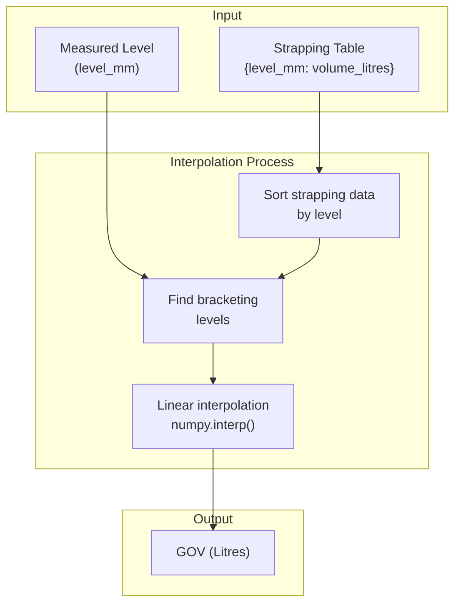

**Formula:**
```
GOV = interpolate(strapping_table, level_mm)

Where strapping_table maps:
  level_mm → volume_litres
```

**Implementation:**
```python
def calculate_gov_from_strapping(level_mm, strapping_data):
    levels = np.array(sorted(strapping_data.keys()))
    volumes = np.array([strapping_data[lvl] for lvl in levels])
    gov = np.interp(level_mm, levels, volumes)
    return float(gov)
```

---

### Volume Correction Factor (VCF)

VCF corrects the observed volume to standard temperature (20°C) based on thermal expansion.

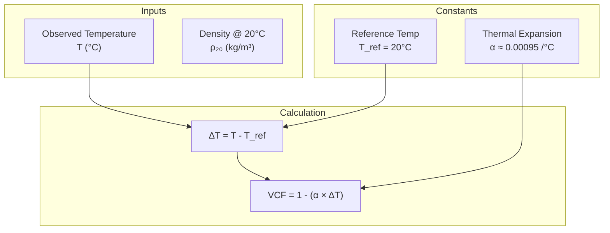

**Formula:**
```
VCF = 1 - α × (T_observed - T_reference)

Where:
  α = Thermal expansion coefficient (~0.00095 /°C for typical petroleum)
  T_reference = 20°C (standard)
```

**Example:**
```
Given:
  T_observed = 30°C
  α = 0.00095 /°C
  T_reference = 20°C

VCF = 1 - 0.00095 × (30 - 20)
VCF = 1 - 0.00095 × 10
VCF = 1 - 0.0095
VCF = 0.9905
```

---

### Gross Standard Volume (GSV)

GSV is the volume corrected to standard temperature (20°C).

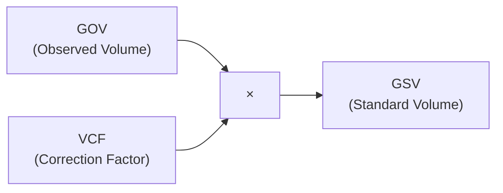

**Formula:**
```
GSV = GOV × VCF
```

**Example:**
```
Given:
  GOV = 500,000 Litres
  VCF = 0.9905

GSV = 500,000 × 0.9905
GSV = 495,250 Litres
```

---

## Mass Balance Calculations

### Temperature-Corrected Density

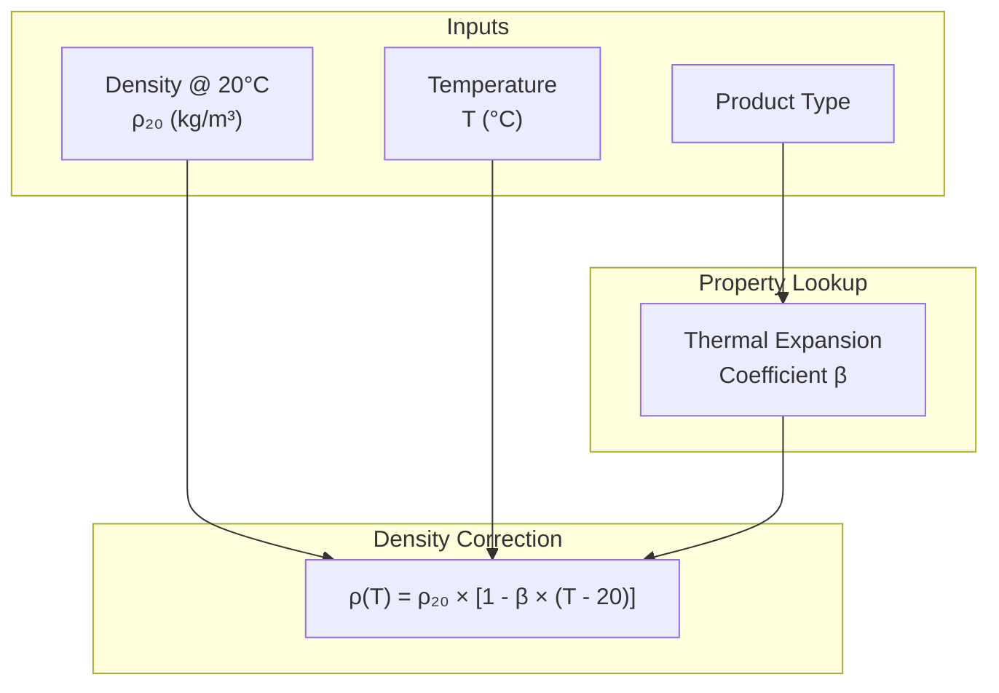

**Formula:**
```
ρ(T) = ρ₂₀ × [1 - β × (T - 20)]

Where:
  ρ₂₀ = Density at 20°C (kg/m³)
  β = Thermal expansion coefficient (per °C)
  T = Observed temperature (°C)
```

**Thermal Expansion Coefficients by Product:**

| Product | Symbol | β (per °C) |
|---------|--------|-----------|
| Gasoline (PMS) | β_PMS | 0.00120 |
| Diesel (AGO) | β_AGO | 0.00083 |
| Kerosene (DPK) | β_DPK | 0.00090 |
| LPG | β_LPG | 0.00300 |
| Residual Fuel (RFO) | β_RFO | 0.00065 |
| Default | β_DEF | 0.00095 |

**Example (Diesel at 30°C):**
```
Given:
  ρ₂₀ = 850 kg/m³
  β = 0.00083 /°C
  T = 30°C

ρ(30) = 850 × [1 - 0.00083 × (30 - 20)]
ρ(30) = 850 × [1 - 0.00083 × 10]
ρ(30) = 850 × [1 - 0.0083]
ρ(30) = 850 × 0.9917
ρ(30) = 842.95 kg/m³
```

---

### Mass Calculation

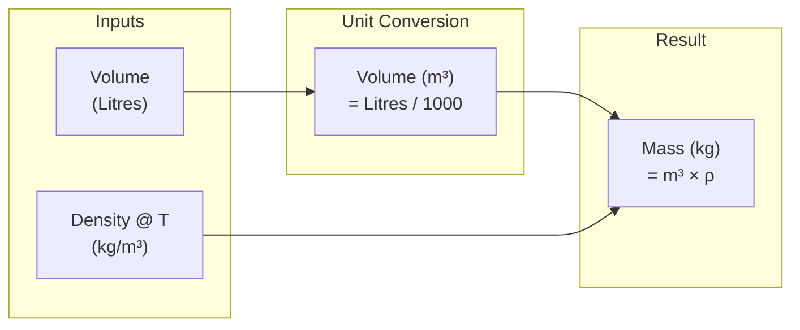

**Formula:**
```
Mass (kg) = Volume (Litres) × Density (kg/m³) / 1000
```

**Example:**
```
Given:
  Volume = 500,000 Litres
  ρ(T) = 842.95 kg/m³

Mass = 500,000 × 842.95 / 1000
Mass = 421,475 kg
Mass = 421.475 tonnes
```

---

## Energy Balance Calculations

### Heat Content (Thermal Energy)

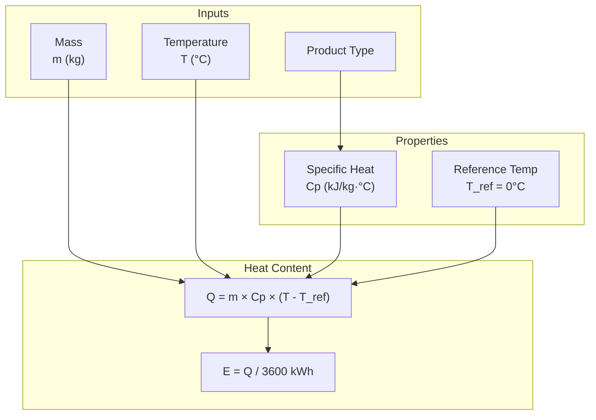

**Formula:**
```
Q = m × Cp × (T - T_ref)

Where:
  Q = Heat content (kJ)
  m = Mass (kg)
  Cp = Specific heat capacity (kJ/kg·°C)
  T = Product temperature (°C)
  T_ref = Reference temperature (0°C)

Energy (kWh) = Q / 3600
```

**Specific Heat Values:**

| Product | Cp (kJ/kg·°C) |
|---------|--------------|
| Gasoline (PMS) | 2.22 |
| Diesel (AGO) | 2.05 |
| Kerosene (DPK) | 2.10 |
| LPG | 2.50 |
| Residual Fuel (RFO) | 1.80 |
| Default | 2.00 |

**Example (Diesel at 30°C):**
```
Given:
  m = 421,475 kg
  Cp = 2.05 kJ/kg·°C
  T = 30°C
  T_ref = 0°C

Q = 421,475 × 2.05 × (30 - 0)
Q = 421,475 × 2.05 × 30
Q = 25,920,713 kJ
Q = 25,920.7 MJ

Energy = 25,920,713 / 3600
Energy = 7,200.2 kWh
```

---

### Heat Transfer Rate

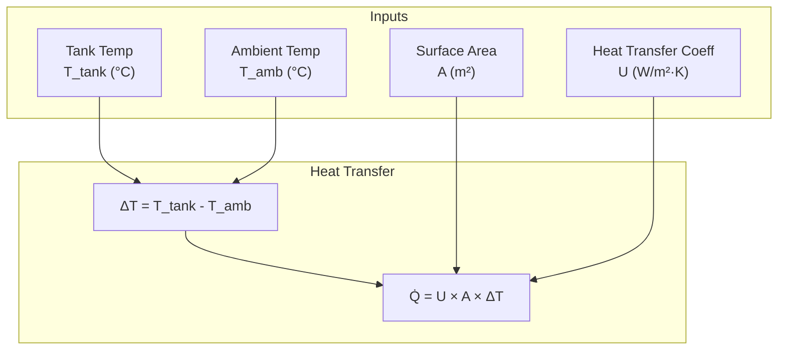

**Formula:**
```
Q̇ = U × A × ΔT

Where:
  Q̇ = Heat transfer rate (W)
  U = Overall heat transfer coefficient (W/m²·K)
  A = Surface area (m²)
  ΔT = Temperature difference (°C or K)
```

**Heat Transfer Coefficients:**

| Condition | U (W/m²·K) |
|-----------|-----------|
| Tank wall, still air | 5.0 |
| Tank wall, windy | 15.0 |
| Tank roof, still air | 8.0 |
| Tank roof, windy | 20.0 |
| Insulated tank | 0.5 |
| Ground contact | 2.0 |

---

### Temperature Prediction (Newton's Law of Cooling)

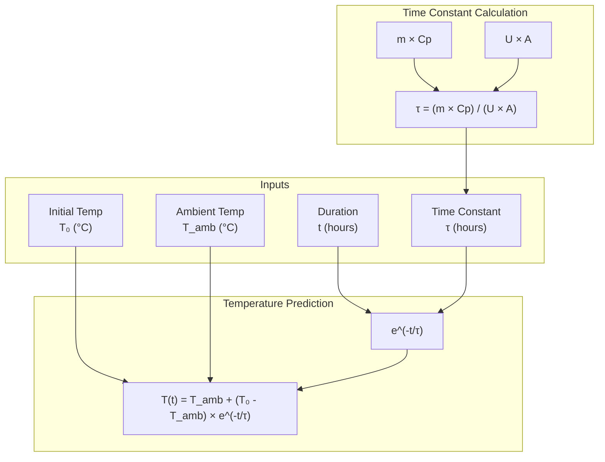

**Formula:**
```
T(t) = T_ambient + (T_initial - T_ambient) × e^(-t/τ)

Where:
  τ = m × Cp / (U × A)  [Time constant in seconds]
  t = Time elapsed (seconds)
```

---

## Power Consumption Calculations

### Pump Hydraulic Power

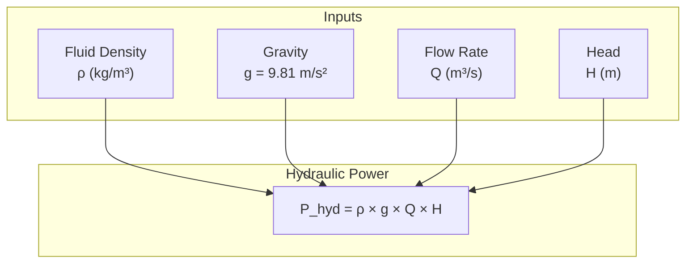

**Formula:**
```
P_hydraulic = ρ × g × Q × H

Where:
  P_hydraulic = Hydraulic power (W)
  ρ = Fluid density (kg/m³)
  g = 9.81 m/s²
  Q = Flow rate (m³/s)
  H = Total dynamic head (m)
```

---

### Pump Electrical Power

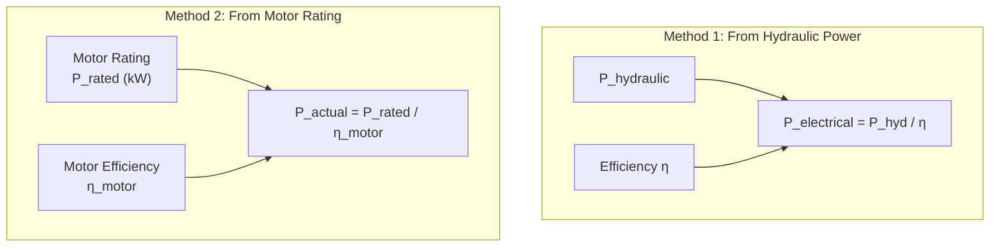

**Formulas:**
```
Method 1 (from hydraulic):
  P_electrical = P_hydraulic / η_pump

Method 2 (from motor rating - used in this system):
  P_actual = P_rated / η_motor

Where:
  η_pump = Pump efficiency (typically 0.75)
  η_motor = Motor efficiency (typically 0.85)
```

---

### Energy Consumption

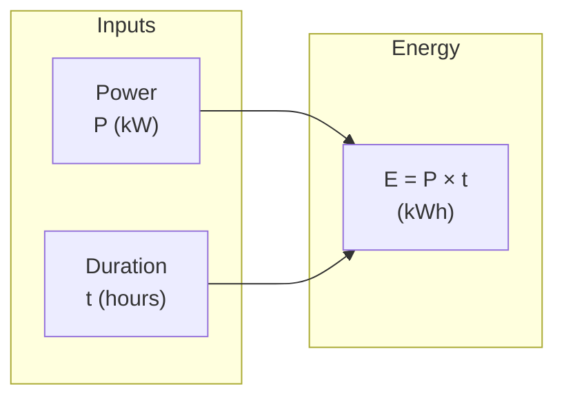

**Formula:**
```
Energy (kWh) = Power (kW) × Time (hours)
```

**Example (30-second interval):**
```
Given:
  P_rated = 55 kW
  η_motor = 0.85
  Interval = 30 seconds = 0.00833 hours

P_actual = 55 / 0.85 = 64.7 kW

Energy = 64.7 × 0.00833
Energy = 0.539 kWh per interval
```

---

## Cost Calculations with Ghana ECG Tariffs

### Tariff Structure Breakdown

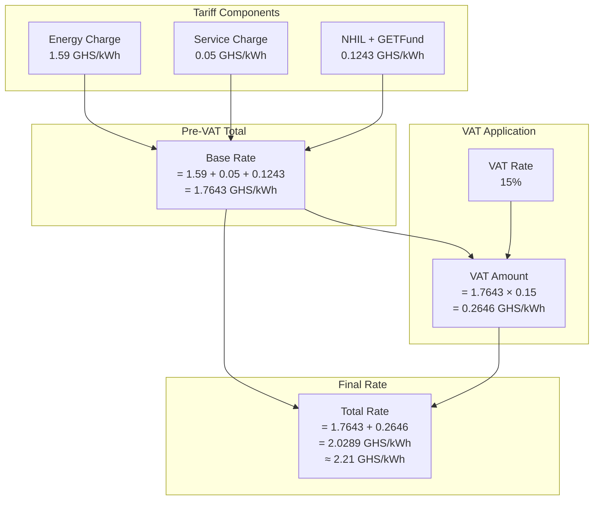

### Detailed Tariff Calculation

```
┌─────────────────────────────────────────────────────────────────────────────┐
│           GHANA ECG NON-RESIDENTIAL TARIFF (Effective May 2025)             │
│                    For Industrial Consumers (1000+ kWh/month)               │
├─────────────────────────────────────────────────────────────────────────────┤
│                                                                              │
│  COMPONENT BREAKDOWN:                                                        │
│  ───────────────────                                                        │
│                                                                              │
│  1. Energy Charge (EC)           = 1.5900 GHS/kWh                           │
│  2. Service Charge (SC)          = 0.0500 GHS/kWh  (Street Light Levy)      │
│  3. NHIL + GETFund               = 0.1243 GHS/kWh                           │
│     ─────────────────────────────────────────────                           │
│     Subtotal (Pre-VAT)           = 1.7643 GHS/kWh                           │
│                                                                              │
│  4. VAT @ 15%                    = 0.2646 GHS/kWh                           │
│     ─────────────────────────────────────────────                           │
│     TOTAL RATE                   = 2.0289 GHS/kWh                           │
│                                                                              │
│  SIMPLIFIED RATE USED: 2.21 GHS/kWh (rounded for practical use)             │
│                                                                              │
├─────────────────────────────────────────────────────────────────────────────┤
│                                                                              │
│  COST CALCULATION FORMULA:                                                   │
│  ─────────────────────────                                                  │
│                                                                              │
│  Operating Cost = Energy (kWh) × Tariff Rate (GHS/kWh)                      │
│                                                                              │
│  Per Interval:                                                               │
│    Cost = (P_actual × interval_hours) × 2.21                                │
│                                                                              │
│  Daily (8 hours operation):                                                  │
│    Cost = P_actual × 8 × 2.21                                               │
│                                                                              │
│  Monthly (assuming 22 working days, 8 hours/day):                           │
│    Cost = P_actual × 8 × 22 × 2.21                                          │
│                                                                              │
└─────────────────────────────────────────────────────────────────────────────┘
```

### Cost Calculation Flow

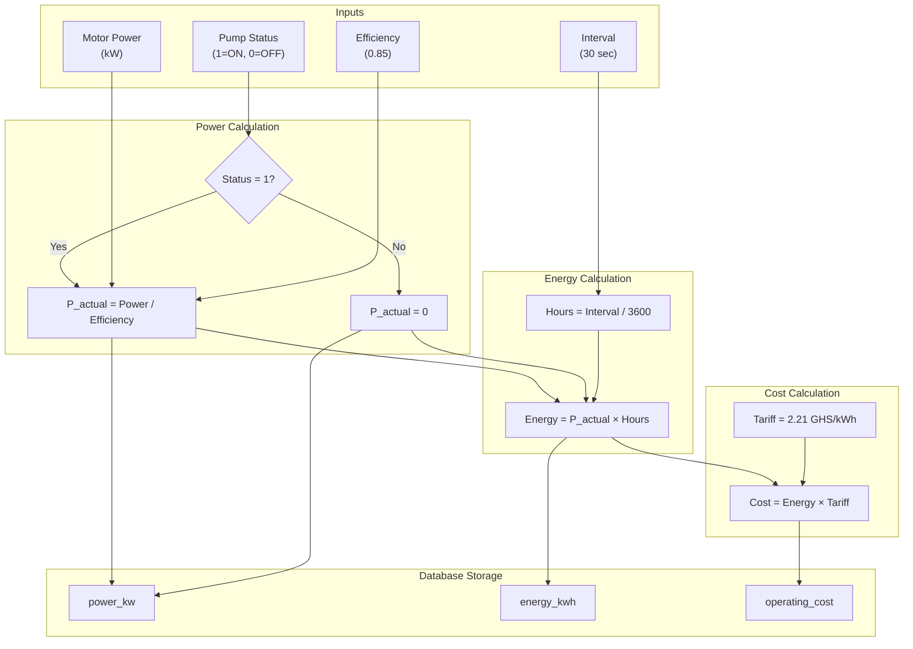

### Complete Cost Example

```
┌─────────────────────────────────────────────────────────────────────────────┐
│                    PUMP OPERATING COST CALCULATION EXAMPLE                   │
├─────────────────────────────────────────────────────────────────────────────┤
│                                                                              │
│  PUMP SPECIFICATIONS:                                                        │
│  ────────────────────                                                       │
│    Motor Power Rating:     55 kW                                            │
│    Motor Efficiency:       85% (0.85)                                       │
│    Calculation Interval:   30 seconds                                       │
│    Pump Status:            Running (1)                                      │
│                                                                              │
│  STEP 1: ACTUAL POWER DRAW                                                  │
│  ─────────────────────────                                                  │
│    P_actual = P_rated / η_motor                                             │
│    P_actual = 55 kW / 0.85                                                  │
│    P_actual = 64.71 kW                                                      │
│                                                                              │
│  STEP 2: ENERGY PER INTERVAL                                                │
│  ───────────────────────────                                                │
│    Interval (hours) = 30 / 3600 = 0.00833 hr                               │
│    Energy = P_actual × Interval                                             │
│    Energy = 64.71 × 0.00833                                                 │
│    Energy = 0.539 kWh                                                       │
│                                                                              │
│  STEP 3: COST PER INTERVAL                                                  │
│  ─────────────────────────                                                  │
│    Tariff Rate = 2.21 GHS/kWh                                              │
│    Cost = Energy × Tariff                                                   │
│    Cost = 0.539 × 2.21                                                      │
│    Cost = 1.19 GHS                                                          │
│                                                                              │
│  EXTRAPOLATED COSTS:                                                         │
│  ───────────────────                                                        │
│    Per Hour:    64.71 × 2.21 = 143.01 GHS                                  │
│    Per 8 Hours: 64.71 × 8 × 2.21 = 1,144.07 GHS                            │
│    Per Day (24h): 64.71 × 24 × 2.21 = 3,432.22 GHS                         │
│    Per Month (22 days × 8h): 64.71 × 176 × 2.21 = 25,169.54 GHS            │
│                                                                              │
└─────────────────────────────────────────────────────────────────────────────┘
```

### Multi-Pump Cost Aggregation

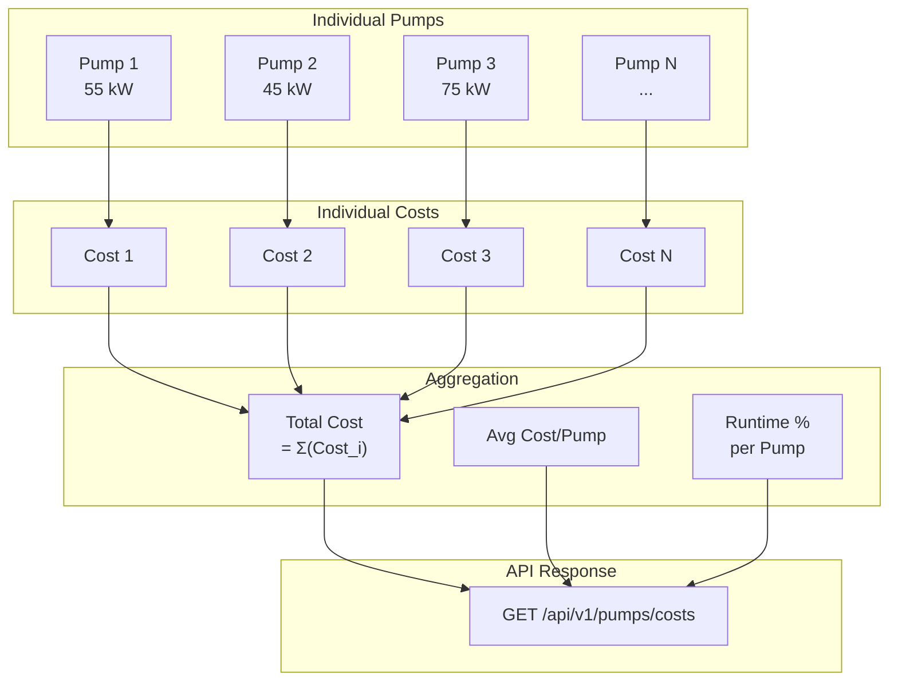

---

## Summary of Key Formulas

| Calculation | Formula | Units |
|-------------|---------|-------|
| GOV | `interpolate(strapping, level_mm)` | Litres |
| VCF | `1 - α × (T - 20)` | dimensionless |
| GSV | `GOV × VCF` | Litres |
| Density @ T | `ρ₂₀ × [1 - β × (T - 20)]` | kg/m³ |
| Mass | `Volume × ρ(T) / 1000` | kg |
| Heat Content | `m × Cp × (T - T_ref)` | kJ |
| Heat Transfer | `U × A × ΔT` | W |
| Pump Power | `P_rated / η_motor` | kW |
| Energy | `Power × Time` | kWh |
| Operating Cost | `Energy × Tariff_Rate` | GHS |

---

*Calculations Reference for Fuel Depot Digital Twin v1.0*
*Ghana ECG Tariffs effective May 2025*
