# Fuel Depot Digital Twin - System Architecture Documentation

## Table of Contents
1. [System Overview](#system-overview)
2. [Architecture Diagrams](#architecture-diagrams)
3. [Data Flow](#data-flow)
4. [Power Consumption & Tariff Calculations](#power-consumption--tariff-calculations)
5. [Physics Engine](#physics-engine)
6. [Database Schema](#database-schema)
7. [API Reference](#api-reference)
8. [Alerting System](#alerting-system)

---

## System Overview

The Fuel Depot Digital Twin is a comprehensive monitoring and simulation platform for petroleum storage facilities. It provides real-time monitoring, physics-based calculations, cost tracking, and alerting for fuel depot operations in Ghana.

### Key Features
- Real-time sensor data collection via MQTT
- Physics-based volume, mass, and energy calculations
- Ghana ECG electricity tariff integration for cost tracking
- Fire consequence simulation
- Tank transfer simulation
- Interactive dashboard with HMI visualization
- Configurable alerting system

---

## Architecture Diagrams

### High-Level System Architecture

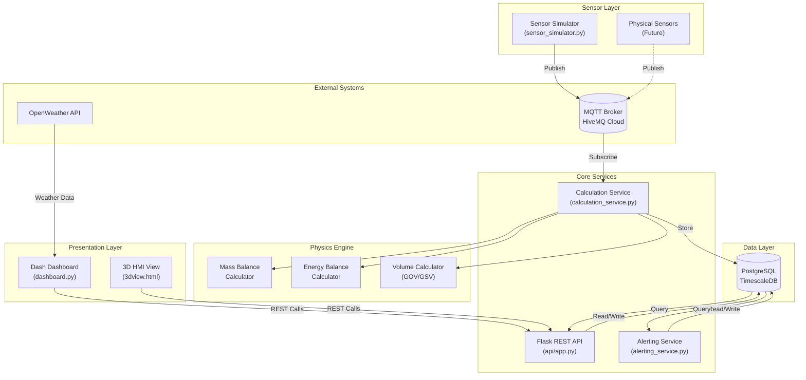

### Service Communication Flow

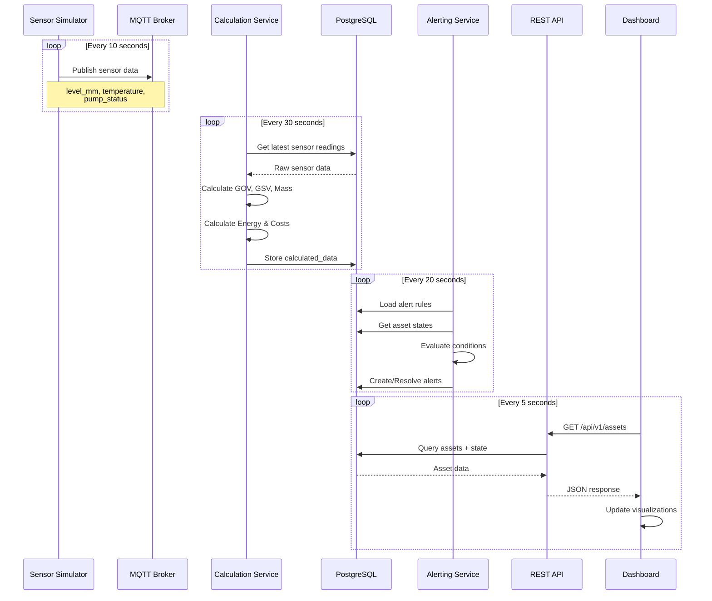

---

## Data Flow

### Sensor Data Pipeline

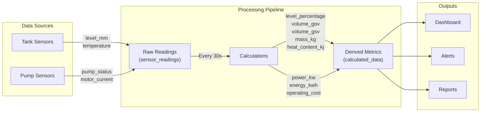

### Tank Metrics Calculation Flow

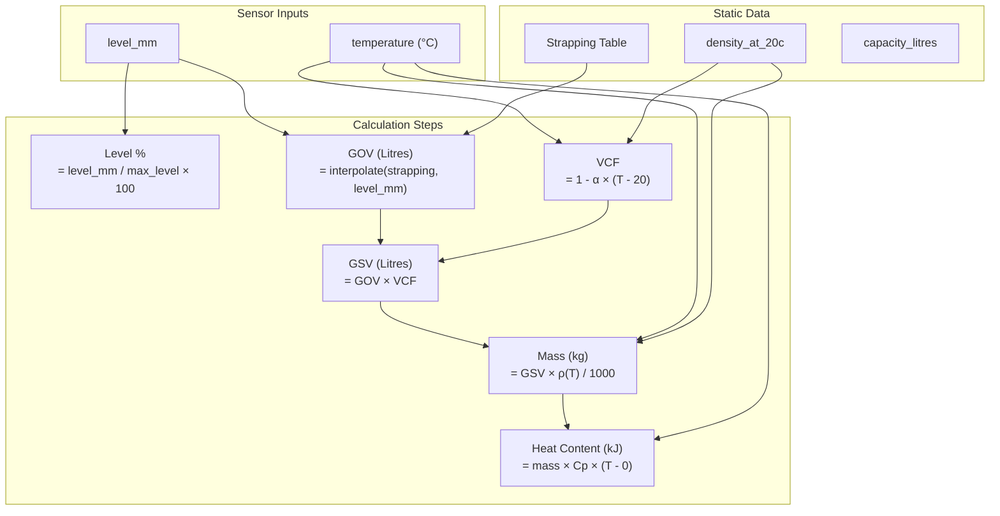

---

## Power Consumption & Tariff Calculations

### Ghana ECG Tariff Structure

The system implements Ghana's Electricity Company of Ghana (ECG) Non-Residential tariff structure for industrial consumers in the 1000+ kWh/month consumption band.

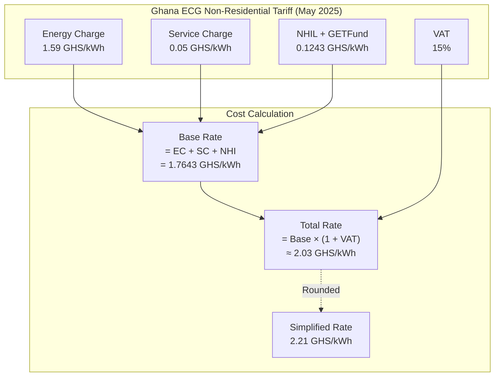

### Pump Power Consumption Calculation

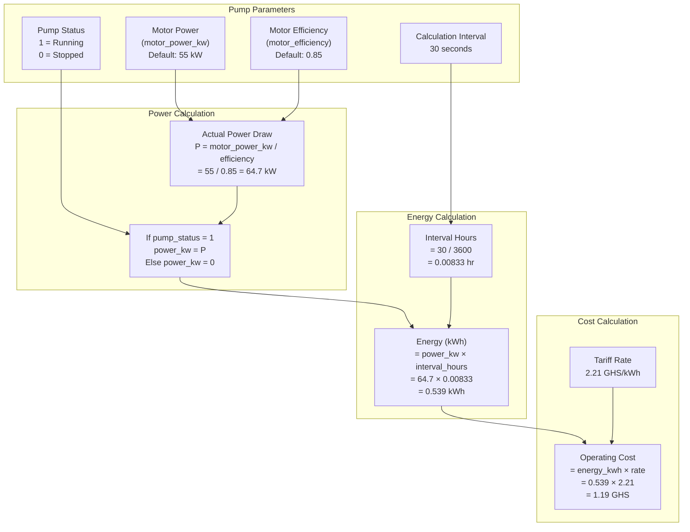

### Detailed Power Calculation Formula

```
┌─────────────────────────────────────────────────────────────────────────────┐
│                    PUMP POWER CONSUMPTION CALCULATION                        │
├─────────────────────────────────────────────────────────────────────────────┤
│                                                                              │
│  1. ACTUAL POWER DRAW (accounting for motor efficiency losses):             │
│                                                                              │
│     P_actual = P_rated / η                                                  │
│                                                                              │
│     Where:                                                                   │
│       P_rated = Motor nameplate power (kW)                                  │
│       η = Motor efficiency (0.85 = 85%)                                     │
│                                                                              │
│     Example: P_actual = 55 kW / 0.85 = 64.7 kW                             │
│                                                                              │
├─────────────────────────────────────────────────────────────────────────────┤
│                                                                              │
│  2. ENERGY CONSUMPTION per interval:                                        │
│                                                                              │
│     E = P_actual × t                                                        │
│                                                                              │
│     Where:                                                                   │
│       t = interval in hours (30s = 0.00833 hr)                             │
│                                                                              │
│     Example: E = 64.7 kW × 0.00833 hr = 0.539 kWh                          │
│                                                                              │
├─────────────────────────────────────────────────────────────────────────────┤
│                                                                              │
│  3. OPERATING COST per interval:                                            │
│                                                                              │
│     Cost = E × Tariff_Rate                                                  │
│                                                                              │
│     Where:                                                                   │
│       Tariff_Rate = 2.21 GHS/kWh (Ghana ECG Non-Residential)               │
│                                                                              │
│     Example: Cost = 0.539 kWh × 2.21 GHS/kWh = 1.19 GHS                    │
│                                                                              │
├─────────────────────────────────────────────────────────────────────────────┤
│                                                                              │
│  4. DAILY COST ESTIMATION (8 hours operation):                              │
│                                                                              │
│     Daily_Cost = P_actual × 8 hr × Tariff_Rate                             │
│                = 64.7 kW × 8 hr × 2.21 GHS/kWh                             │
│                = 1,143.90 GHS/day per pump                                  │
│                                                                              │
└─────────────────────────────────────────────────────────────────────────────┘
```

### Tariff Configuration (Environment Variables)

```python
# Ghana ECG Non-Residential Tariffs (Effective 1st May 2025)
ENERGY_CHARGE_PER_KWH = 1.59    # GHS/kWh - Base energy charge
SERVICE_CHARGE_PER_KWH = 0.05   # GHS/kWh - Street light levy
NHIL_GETFUND_PER_KWH = 0.1243   # GHS/kWh - National Health Insurance + GETFund
VAT_RATE = 0.15                  # 15% Value Added Tax

# Simplified total rate (pre-calculated)
ELECTRICITY_RATE_PER_KWH = 2.21  # GHS/kWh - All-inclusive rate
```

---

## Physics Engine

### Mass Balance Calculator

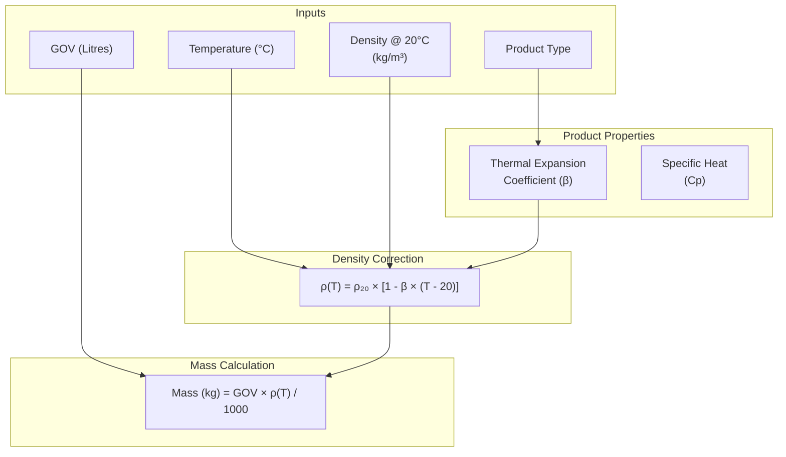

### Product Properties Database

| Product | Code | Thermal Expansion (β) | Specific Heat (Cp) | Typical Density @ 20°C |
|---------|------|----------------------|-------------------|----------------------|
| Gasoline | PMS | 0.00120 /°C | 2.22 kJ/kg·°C | 740 kg/m³ |
| Diesel | AGO | 0.00083 /°C | 2.05 kJ/kg·°C | 850 kg/m³ |
| Kerosene | DPK | 0.00090 /°C | 2.10 kJ/kg·°C | 800 kg/m³ |
| LPG | LPG | 0.00300 /°C | 2.50 kJ/kg·°C | 540 kg/m³ |
| Residual Fuel | RFO | 0.00065 /°C | 1.80 kJ/kg·°C | 980 kg/m³ |

### Energy Balance Calculator

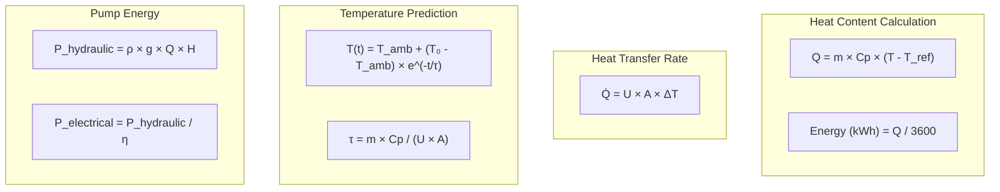

### Heat Transfer Coefficients

| Condition | U (W/m²·K) | Description |
|-----------|-----------|-------------|
| Still Air | 5.0 | Tank wall to calm ambient air |
| Windy | 15.0 | Tank wall with wind exposure |
| Roof (Still) | 8.0 | Tank roof to still air |
| Roof (Windy) | 20.0 | Tank roof with wind |
| Insulated | 0.5 | Insulated tank wall |
| Ground | 2.0 | Tank bottom to ground |

---

## Database Schema

### Entity Relationship Diagram

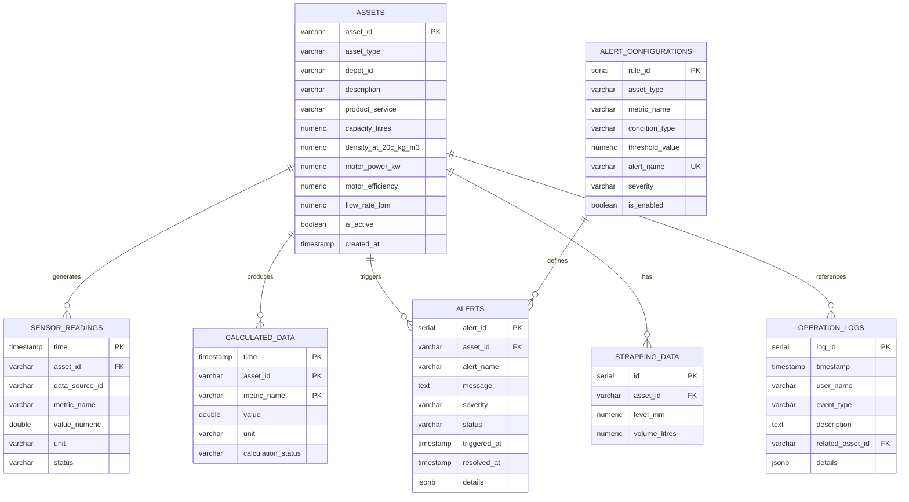

### Key Metrics Stored

#### Sensor Readings (sensor_readings)
| Metric | Unit | Source | Description |
|--------|------|--------|-------------|
| level_mm | mm | Tank sensor | Tank liquid level |
| temperature | °C | Tank sensor | Product temperature |
| pump_status | - | Pump sensor | 1=Running, 0=Stopped |
| motor_current | A | Pump sensor | Motor current draw |

#### Calculated Data (calculated_data)
| Metric | Unit | Description |
|--------|------|-------------|
| level_percentage | % | Tank fill percentage |
| volume_gov | Litres | Gross Observed Volume |
| volume_gsv | Litres | Gross Standard Volume @ 20°C |
| mass_kg | kg | Product mass |
| density_at_temp | kg/m³ | Temperature-corrected density |
| heat_content_kj | kJ | Thermal energy content |
| power_kw | kW | Instantaneous pump power |
| energy_kwh | kWh | Energy consumed per interval |
| operating_cost | GHS | Cost per interval |

---

## API Reference

### Endpoints Overview

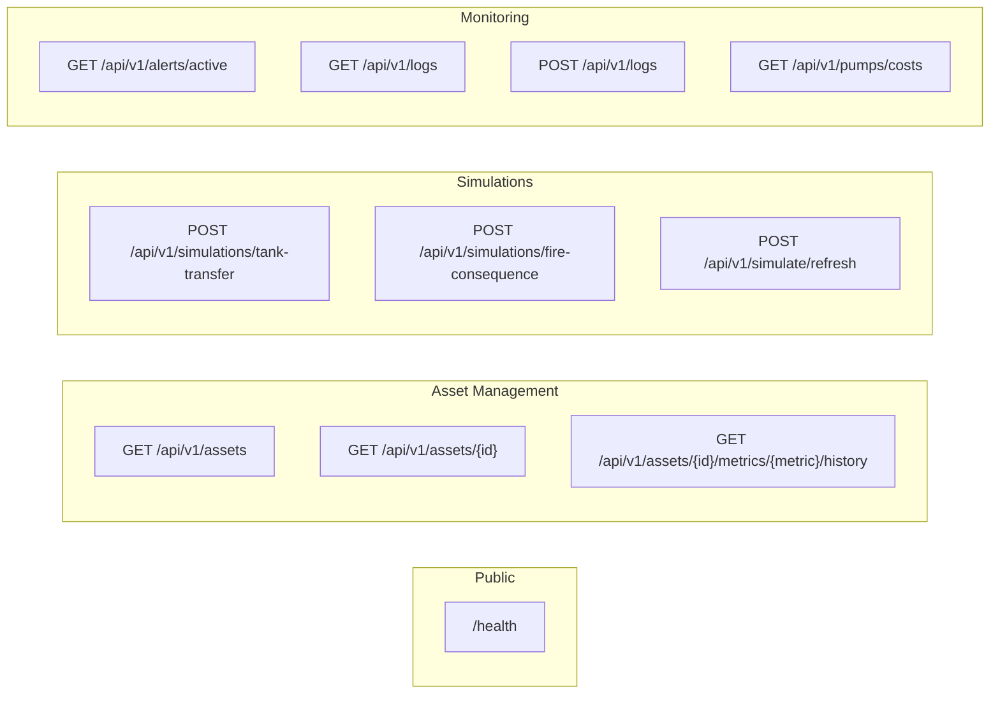

### Authentication
All endpoints (except `/health`) require API key authentication via the `x-api-key` header.

```bash
curl -H "x-api-key: YOUR_API_KEY" http://localhost:5000/api/v1/assets
```

### Endpoint Details

#### GET /api/v1/pumps/costs
Returns pump operating costs with tariff breakdown.

**Query Parameters:**
- `start_time` (optional): ISO datetime, defaults to 24 hours ago
- `end_time` (optional): ISO datetime, defaults to now
- `pump_id` (optional): Filter by specific pump

**Response:**
```json
{
  "time_range": {
    "start": "2025-01-10T00:00:00+00:00",
    "end": "2025-01-11T00:00:00+00:00"
  },
  "tariff": {
    "rate_per_kwh": 2.21,
    "currency": "GHS",
    "description": "Ghana ECG Non-Residential (1000+ kWh band, incl. VAT)"
  },
  "summary": {
    "total_energy_kwh": 1547.32,
    "total_cost_ghs": 3419.58,
    "pump_count": 12
  },
  "pumps": [
    {
      "asset_id": "PUMP-001",
      "description": "Main Transfer Pump 1",
      "motor_power_kw": 55.0,
      "pump_house_id": "PH-01",
      "total_energy_kwh": 258.45,
      "total_cost_ghs": 571.17,
      "runtime_percentage": 45.2
    }
  ]
}
```

---

## Alerting System

### Alert Flow

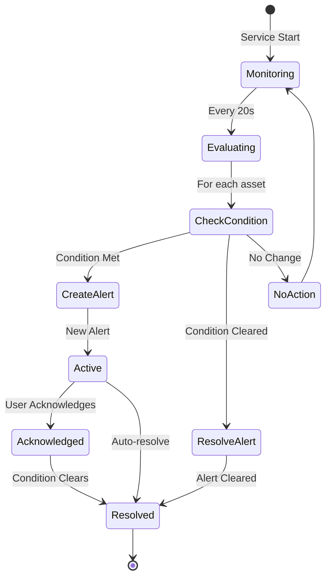

### Alert Configuration

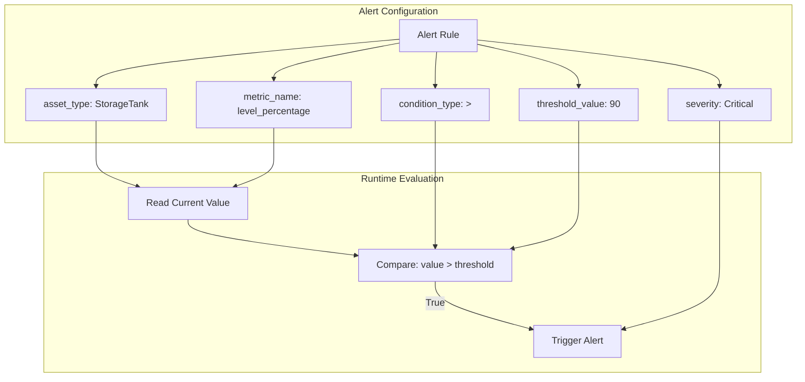

### Example Alert Rules

| Rule | Asset Type | Metric | Condition | Threshold | Severity |
|------|-----------|--------|-----------|-----------|----------|
| High Level | StorageTank | level_percentage | > | 90% | Critical |
| Low Level | StorageTank | level_percentage | < | 10% | Critical |
| High Temp | StorageTank | temperature | > | 45°C | Warning |
| Pump Overload | Pump | power_kw | > | 70 kW | Warning |

---

## Deployment Architecture

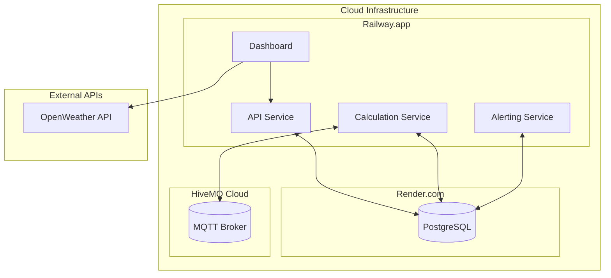

---

## Configuration Reference

### Environment Variables

| Variable | Default | Description |
|----------|---------|-------------|
| `API_KEY` | - | API authentication key |
| `DATABASE_URL` | - | PostgreSQL connection string |
| `MQTT_BROKER_ADDRESS` | localhost | MQTT broker hostname |
| `MQTT_BROKER_PORT` | 1883 | MQTT broker port |
| `MQTT_USE_TLS` | false | Enable TLS for MQTT |
| `ELECTRICITY_RATE_PER_KWH` | 2.21 | Ghana ECG tariff rate |
| `ENERGY_CHARGE_PER_KWH` | 1.59 | Base energy charge |
| `SERVICE_CHARGE_PER_KWH` | 0.05 | Service charge |
| `NHIL_GETFUND_PER_KWH` | 0.1243 | NHIL + GETFund levy |
| `VAT_RATE` | 0.15 | VAT rate (15%) |
| `SIMULATION_INTERVAL_SECONDS` | 10 | Sensor simulation interval |
| `STANDARD_REFERENCE_TEMPERATURE_CELSIUS` | 20.0 | Reference temp for GSV |

---

*Documentation generated for Fuel Depot Digital Twin v1.0*
*Last updated: January 2026*
